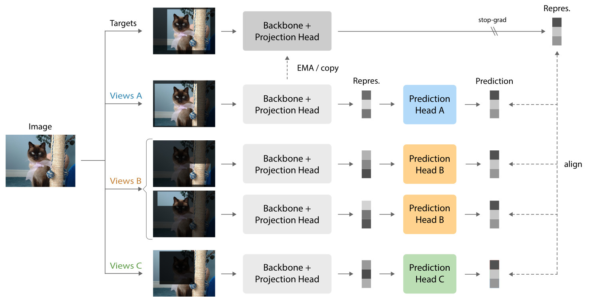

# Self-Supervised Learning with a Multi-Task Latent Space Objective

This repository contains the code and pre-trained models for the paper "Self-Supervised Learning with a Multi-Task Latent Space Objective" (MULAN).

Paper link: [https://arxiv.org/abs/2602.05845](https://arxiv.org/abs/2602.05845)



## Pretrained Models

The following table summarizes the linear evaluation accuracy of various self-supervised learning methods trained with the multi-task latent space objective on ImageNet-1k. 

| Method             | Backbone  | Epochs | Lin. Acc. (%) | Backbone weights |
|--------------------|-----------|--------|---------------|------------------|
| SimSiam multi-task | ResNet-50 | 200    | 74.7          | [Link](https://github.com/pfdp0/mulan/releases/download/v1.0/simsiam_multitask_resnet50_200ep_ckpt.pth)        |
| MoCo v3 multi-task | ResNet-50 | 200    | 75.3          | [Link](https://github.com/pfdp0/mulan/releases/download/v1.0/mocov3_multitask_resnet50_200ep_ckpt.pth)        |
| BYOL multi-task    | ResNet-50 | 200    | 75.6          | [Link](#)        |
| BYOL multi-task    | ResNet-50 | 800    | 76.7          | [Link](https://github.com/pfdp0/mulan/releases/download/v1.0/byol_multitask_resnet50_800ep_ckpt.pth)        |
| BYOL multi-task    | ViT-S     | 200    | 74.0          | [Link](https://github.com/pfdp0/mulan/releases/download/v1.0/byol_multitask_vits_200ep_ckpt.pth)        |
| BYOL multi-task    | ViT-B     | 200    | 77.7          | [Link](https://github.com/pfdp0/mulan/releases/download/v1.0/byol_multitask_vitb_200ep_ckpt.pth)        |

## Installation

You can install the dependencies using pip:

```bash
pip install torch==2.8 torchvision torchaudio detectron2 tqdm matplotlib wandb scipy scikit-learn
```

Alternatively, to install the dependencies using mamba, you can run the following commands:

```bash
mamba create -n mulan_env python=3.12 pip
mamba activate mulan_env
mamba install pytorch==2.8 torchvision torchaudio detectron2 tqdm matplotlib wandb scipy anaconda::scikit-learn
```

Note: the detectron2 dependency is only required for object detection and instance segmentation transfer learning experiments.

## Usage

Pre-training a ResNet-50 BYOL with multi-task latent space objective on ImageNet-1k for 200 epochs on one node with 4 GPUs:
```bash
torchrun --standalone --nproc_per_node 4 main.py --training_fn byol_multitask --transform multitask --tasks global local cutout --num-views-per-task 2 2 1 --task-weights 1.0 1.0 1.0
```

Or with a single GPU (max memory will be around 24GB):
```bash
python main.py --batch-size 512 --training_fn byol_multitask --transform multitask --tasks global local cutout --num-views-per-task 2 2 1 --task-weights 1.0 1.0 1.0
```

For more details on the training configurations, please refer to the [CONFIG.md](CONFIG.md) file.

Linear evaluation of a pre-trained ResNet-50 model:
```bash
python linear_eval.py --backbone resnet50 --pretrained PATH/TO/PRETRAINED/WEIGHTS.pth
```

## Citation

Please consider citing our paper if you find this code useful for your research:

```
@article{deplaen2026mulan,
      title={Self-Supervised Learning with a Multi-Task Latent Space Objective}, 
      author={De Plaen, Pierre-François and Jha, Abhishek and Van Gool, Luc and Tuytelaars, Tinne and Proesmans, Marc},
      journal={arXiv preprint arXiv:2602.05845},
      year={2026}
}
```
